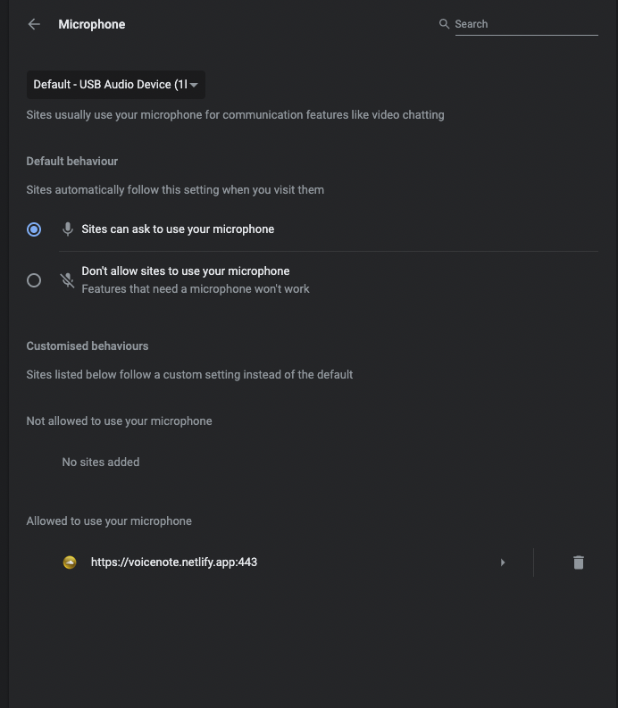
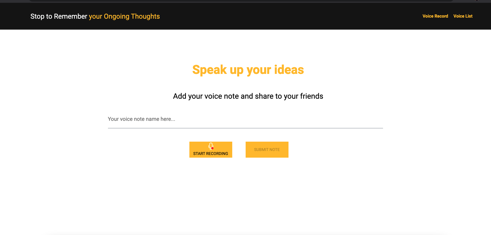
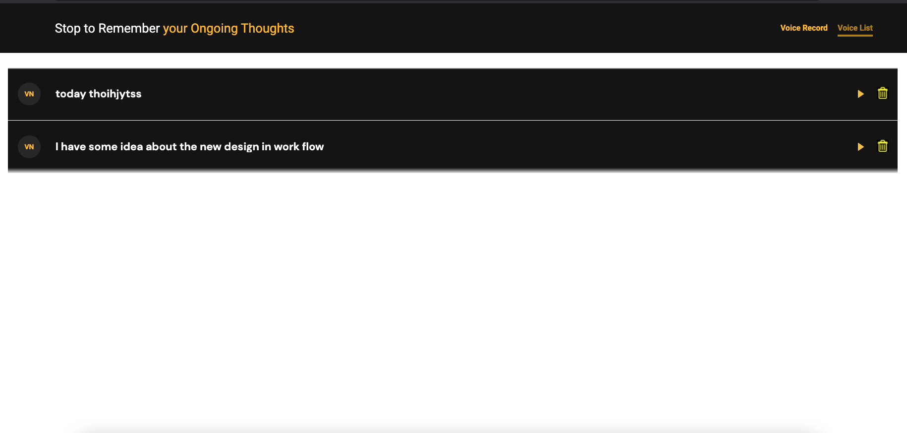

# Voice Notes Tool
This app is a simple audio recorder tool.It's useful for saving a voice notes for your ongoing thoughts as well as add todos and your daily routines. We mostly used text note and other app for our todos but it's quick and very easy to use in daily routines.

We are only allow to record 30 sec voice note so after 30 sec recording will be auto stopped.

# Host

I have hosted this app on netlify server. Here is the URL
https://voicenote.netlify.app/

# Technologies

ReactJS, Redux, vmsg, WebRTC, IndexDB

# Purpose

Mainly while recording a audio using browser or chrome it gives us audio/webm format and that only play in web not in mobile devices so in our project we have used web assembly file to convert webm to mp3 so that it will support in all devices.

# What I did
Created react app with using create-react-app.\
Used redux for state management (Action, Reducer, store , Constant, selectors).\
Used react-redux for subscribing store and dispatching actions.\
Used reactJS latest hooks.\
Handle lazy load module and components.\
Used SCSS structure - Created global color variables and used in the app also created a global style sheet for common css.\
Create audio recorder service for recording auido and used wasm file to convert that audio into MP3 Format.\
Created MP3 Recorder service with the reference of vmsg, module and created service for it.\
Created Toaster service for showing toaster globally also done some customization in that.\
Created IndexDB local storage service for perform CRUD operation.\
Used CSS Transition for animation in voicelist player.\
Used react-audio player  (https://www.npmjs.com/package/react-audio-player) for playing  audio.\
Created Two module player and voice list.\
Convert blob to array buffer and store in index db and when going to playe again conver in blob url and play the audio\
Handled audio permission - Untill allow microphone, User can't record a audio
Handled 30 sec audio recording
Created Utils service for converting buffer to array and Array to Buffer

# check the permission for mirophone

While going to first time record audio, there is one popop comes for asking a persmission for the microphone so click on allow will able to record audio also you can check you permission in chrome -> setting -> site setting.

# Challenges

### `Conversion of audio/webm format to audio/mp3`
This thing is very challenges like one my project is based on voice messaging and that support many platforms like android /ios(Mobile),  MAC/Lnix/Windows(Desktop) so all device have their own limits and capabilities so in that I need to conevert webm file to mp3 because mp3 supports in all platforms.\

### `Store audio voice messages to IndexDB`
IndexDB has less capabilities also there is some limitation too.First I tried with stire a blob URL and play the url in player it works but after reloading the tab it just clear the blob which was stored temporary in memory so after that I google and find a solution like convert a blob to array buffer and store in index db and while playing convert to blobn from array buffer.

### `Conversion of Arraybuffer to blob `
While converting a list of array buffer to blob I facing the issue of asynchronization beacuse there are different size of buffer and all have different size so I used promise.all in map function to wait until all buffer convert into blob.

# Sources
For audio mp3 conversion https://github.com/Kagami/vmsg
For React Concept - https://reactjs.org/

## Available Scripts

In the project directory, you can run:

### `yarn start`

Runs the app in the development mode.\
Open [http://localhost:3000](http://localhost:3000) to view it in the browser.

The page will reload if you make edits.\
You will also see any lint errors in the console.

### `yarn test`

Launches the test runner in the interactive watch mode.\
See the section about [running tests](https://facebook.github.io/create-react-app/docs/running-tests) for more information.

### `yarn build`

Builds the app for production to the `build` folder.\
It correctly bundles React in production mode and optimizes the build for the best performance.

The build is minified and the filenames include the hashes.\
Your app is ready to be deployed!

See the section about [deployment](https://facebook.github.io/create-react-app/docs/deployment) for more information.

### `yarn eject`

**Note: this is a one-way operation. Once you `eject`, you can’t go back!**

If you aren’t satisfied with the build tool and configuration choices, you can `eject` at any time. This command will remove the single build dependency from your project.

Instead, it will copy all the configuration files and the transitive dependencies (webpack, Babel, ESLint, etc) right into your project so you have full control over them. All of the commands except `eject` will still work, but they will point to the copied scripts so you can tweak them. At this point you’re on your own.

You don’t have to ever use `eject`. The curated feature set is suitable for small and middle deployments, and you shouldn’t feel obligated to use this feature. However we understand that this tool wouldn’t be useful if you couldn’t customize it when you are ready for it.

### `yarn build` fails to minify

Preview app

